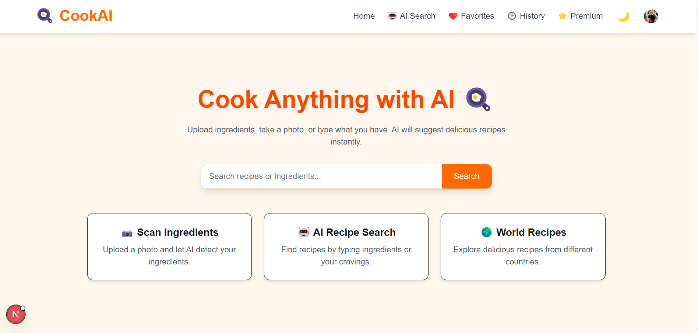

# Cook AI

An AI-powered recipe recommendation platform — upload ingredients, snap a photo, or type what you have, and get instant recipe suggestions.

## Screenshots

**Home page**


**AI-generated recipe results**
.png)
## Features

* Scan Ingredients — upload a photo and let AI detect ingredients automatically
* AI Recipe Search — find recipes by typing ingredients or cravings
* World Recipes — explore recipes from different countries/cuisines
* Favorites — save recipes you love
* History — track previously searched/viewed recipes
* User Authentication — secure sign-up/login powered by Clerk
* Premium tier support
* Dark mode
* Recipe cards with prep time, cuisine tag, and favorite toggle
* Content management via Strapi CMS
* REST API-driven architecture connecting the frontend, CMS, and database

## Tech Stack

* Frontend: Next.js, React, TypeScript
* Backend / CMS: Strapi
* Authentication: Clerk
* Database ORM: Prisma
* Deployment & Tooling: Docker, Firebase, Git

## Project Structure

cook-ai/
├── app/              # Next.js app directory (pages, routes, components)
├── prisma/           # Prisma schema and database config
├── public/           # Static assets
├── middleware.ts     # Next.js middleware (Clerk auth middleware)
└── ...config files (eslint, postcss, tsconfig, next.config)

## Getting Started

### Prerequisites

* Node.js (v18+)
* npm or yarn
* A PostgreSQL/MySQL database (or your Prisma-configured DB)
* Strapi instance (local or hosted)
* Clerk account (for authentication keys)


### Installation

1. Clone the repository
```bash
   git clone https://github.com/nidhi-droid/cook-ai.git
   cd cook-ai
```

2. Install dependencies
```bash
   npm install
```

3. Set up environment variables — create a `.env` file with:
4. DATABASE_URL=your_database_connection_string
STRAPI_API_URL=your_strapi_instance_url


4. Run Prisma migrations
```bash
   npx prisma migrate dev
```

5. Start the development server
```bash
   npm run dev
```

6. Open http://localhost:3000 in your browser

## Author

**Nidhi Yadav**
[GitHub](https://github.com/nidhi-droid) · (https://www.linkedin.com/in/nidhi-yadav-569049286/)
